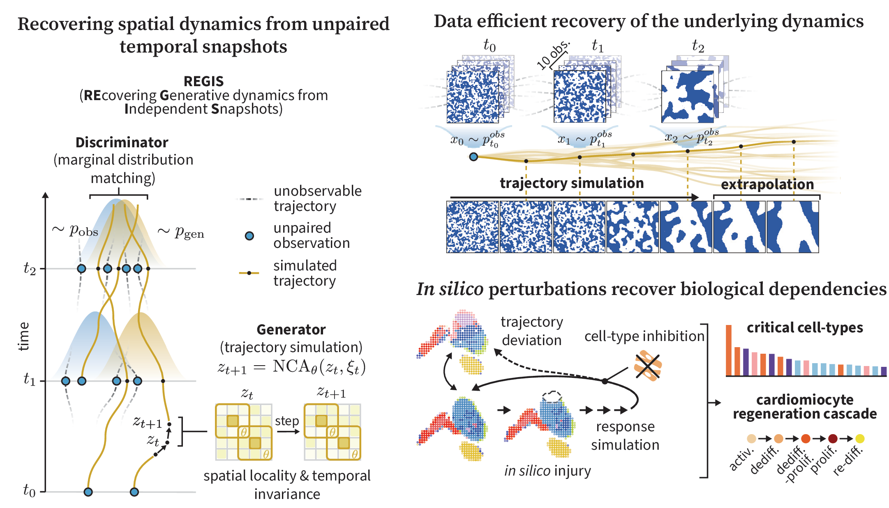

# REGIS

[](https://anon03752.github.io/regis-demo/)
[](LICENSE)



Code accompanying **ICLR 2027** submission **Simulate, Don't Interpolate: Recovering Continuous Spatial Dynamics from Discrete, Unpaired Snapshots**.

Motivated by the challenges of analysing spatiotemporal data in biology, **REGIS** (REcovering Generative dynamics from Independent Snapshots) learns to simulate spatial processes from time-labelled snapshots, without paired observations. A neural cellular automaton (NCA) learns a local, time-invariant update rule through adversarial training, allowing for simulation of stable, long and perturbable trajectories.

Please visit our [project page](https://anon03752.github.io/regis-demo/) to view animations of the model in action and play with the interactive simulations.

## Installation

From the repository root, install the dependencies in a Python environment:

```bash
pip install -r requirements.txt
```

## 5-minute quick start

You can generate short simulation videos from the included checkpoints using the following commands:

```bash
python simulate_ising.py --output videos/ising.mp4
python simulate_mnist.py --output videos/mnist.mp4
python simulate_hearts.py --output videos/hearts.mp4
```

All three scripts finish in under 1 minute when run on CPU.

## Training

To train from scratch, for example on the Ising model data, run:

```bash
python -m domains.ising.data marginals
python -m domains.ising.train --seed 0 --run-name regis_k3_seed0
```

Training takes approximately 2.5 hours on one H100. Commands for the other experiments, baselines, evaluation, tables, figures, and tests are in [Reproducing the paper](docs/reproduce.md).

## Experiments

- **[Cycling MNIST](docs/reproduce.md#reproducing-the-cycling-mnist-experiment)** — learning a repeating sequence of digit transitions and evaluating image quality over long rollouts. [Code](domains/mnist/).
- **[Ising model](docs/reproduce.md#reproducing-the-ising-experiment)** — learning spin dynamics from unpaired snapshots, with tests of domain growth, transition rates, and data efficiency. [Code](domains/ising/).
- **[Zebrafish heart regeneration](docs/reproduce.md#reproducing-the-heart-regeneration-experiment)** — simulating regeneration from spatial transcriptomics snapshots and probing cell-type dependencies through perturbations. [Code](domains/hearts/).

## Data and reproducibility

MNIST is downloaded automatically, and the Ising data are generated procedurally locally. The zebrafish heart regeneration experiment uses the published dataset linked in its [data instructions](docs/reproduce.md#1-the-cohort), which also includes data processing instructions.
